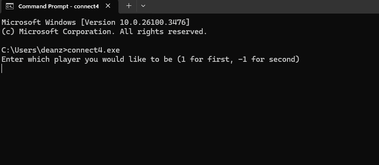

# Connect4-MCTS

An AI that plays Connect 4 using [Monte Carlo Tree Search (MCTS)](https://en.wikipedia.org/wiki/Monte_Carlo_tree_search), written in C++.

The bot simulates thousands of games per second to decide the best move. You can play against it directly in the terminal.

---

## Demo

Here's a short clip of me playing against the AI:



---

## How It Works

The MCTS agent:
- Builds a game tree with potential moves
- Runs thousands of randomized simulations
- Selects moves using Upper Confidence Bound (UCB)
- Gets stronger the longer you let it think

---

## How to Run Locally

### 1. Compile

Make sure you have a C++ compiler installed (like `g++`). Then in the terminal:

```bash
g++ main.cpp Board.cpp getWinner.cpp -o connect4
```

Then run the file
```bash

./connect4
```
You will be promted to choose whether to play first or second. Use numbers 0-6 to place pieces in columns.

## Future Work

- Clean up and refactor code
- Add a way to measure relative bot strength
- Experiment with self-play and reinforcement learning
- Build a simple clickable GUI or web version

